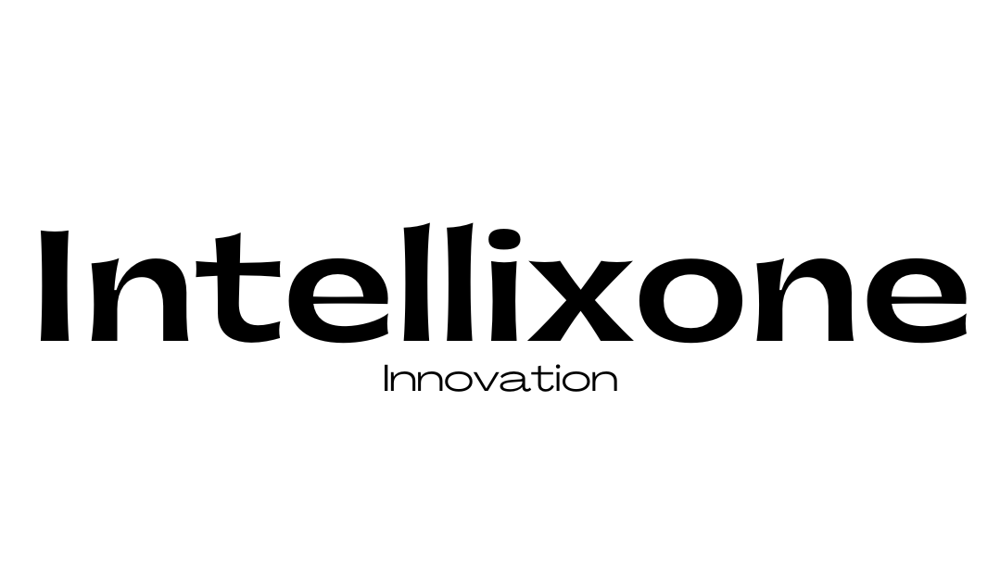

# **Intellixone Innovation©: Pioneering Web 3.0 and AI Development**

Welcome to the future of technology innovation with Intellixone Innovation! Founded by Debarshee Chakraborty, a visionary Data Scientist and Web 3.0 architect, our startup is a testament to the endless possibilities of merging cutting-edge technologies.

At Intellixone, we're on a mission to reshape the digital landscape, one project at a time. Our focus? The dynamic synergy between Web 3.0 and Artificial Intelligence (AI). As a solo entrepreneur-led venture, we bring a personalized touch to our work, ensuring every project is a testament to excellence and innovation.

Join us on this exhilarating journey as we harness the potential of Web 3.0's decentralized web and AI's transformative capabilities. From groundbreaking applications to revolutionary solutions, Intellixone Innovation is where tomorrow's tech takes shape today.

## Connect with Us

At Intellixone Innovation, we value the connections we build with our community, partners, and anyone passionate about the future of technology. Here's how you can connect with our founder, Debarshee Chakraborty, and explore our exciting projects:

### **1. Connect with Debarshee Chakraborty**

Our founder, Debarshee Chakraborty, is not just a visionary but also an advocate for open dialogue and collaboration. Connect with Debarshee to discuss ideas, share insights, or simply have a conversation about the future of technology.

- **LinkedIn**: [Debarshee Chakraborty's LinkedIn Profile](https://www.linkedin.com/in/debarshee-chakraborty-a88b47266/)
- **Twitter**: [@DebarsheeChakr4](https://twitter.com/DebarsheeChakr4)
- **Email**: [debarsheechakraborty@gmail.com](mailto:debarsheechakraborty.11d@gmail.com)

Feel free to reach out, ask questions, or share your thoughts. Debarshee is eager to engage with like-minded individuals who are passionate about tech innovation.

### **2. Explore Our Projects**

Stay up-to-date with our latest projects, developments, and innovations. We're constantly pushing the envelope in the fields of Web 3.0 and AI, and we want you to be a part of this journey.

- **Website**: [Intellixone.app](https://intellixone.netlify.app)

Visit our projects page to learn more about our ongoing initiatives, their impact, and how they align with our vision for the future. We believe in transparency and sharing our progress with the world.
